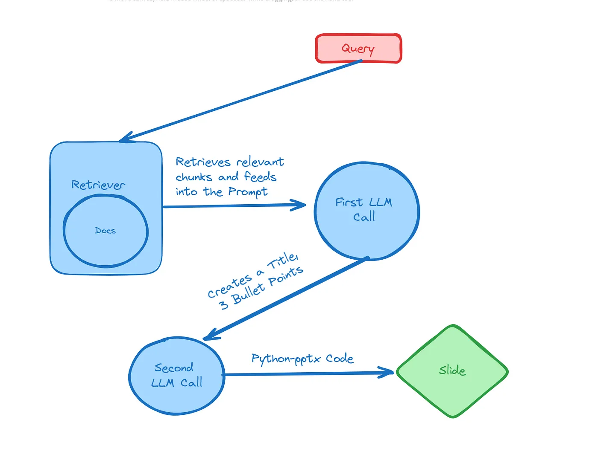

# AI PPTX Creator

In the corporate world slides are everywhere, it is often used as a way to communicate idea and achievements. Making slides is something most people do every week and could be very time consuming.

Python has a library called Python-pptx which allows users to programmatically create PowerPoint presentations. In this project we will the [Recent threats in the Red Sea](https://www.europarl.europa.eu/RegData/etudes/BRIE/2024/760390/EPRS_BRI(2024)760390_EN.pdf) pdf file, published by the European Parliament in 2024, as information source to create a pptx file with the assistant of LLM.

The pipeline is as follows:

1. We make a query to retrieve information from a vector database.
2. We feed a first LLM to create a bullet point list.
3. With that list, we ask a second LLM to create Python-pptx code.
4. We execute that code to create a pptx file.
